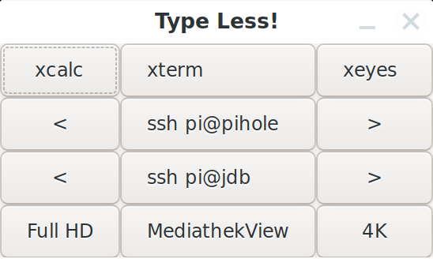

# Type Less!

There are hundreds of tools like this for Linux desktops, but none is the way I wanted it. So I invented this tiny Python script that allows you to run anything by a click a on a button that you would otherwise run from a command line.

Just one file called **type-less.py**, containing code and config. Edit the script and replace the example data in the array called **elements** with your own configuration. You could add the script as a launcher on a panel of your Linux desktop.

The fields of the array have the following meaning:
1. Window row for the button to appear on
1. Window column for the button to appear on
1. Number of columns for the button to span
1. Number of rows for the button to span
1. Horizontal alignment for the button label (0.0 = left, 0.5 = center, 1.0 = right)
1. Label text
1. Command to be executed

